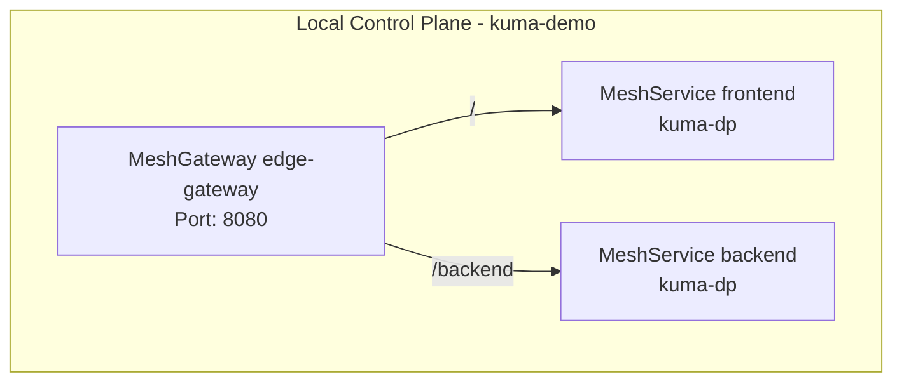

# kuma-demo-lite

> 🚀 一个最小化的 Kuma Service Mesh Docker 演示环境，包含 mTLS、流量权限控制和 MeshGateway 路由。

## 📌 项目简介
`kuma-demo-lite` 是一个**轻量级 Kuma Service Mesh 实验环境**，不依赖 Kubernetes，仅使用 Docker 即可运行。  
它演示了以下核心功能：

- 单 Zone 下的多 Mesh 配置
- 服务间 **mTLS 加密通信**
- 基于 **TrafficPermission** 的细粒度访问控制
- 使用 **MeshGateway** 实现前后端路由转发
- 在 Docker 中 **直接在应用容器内运行数据平面代理（kuma-dp）**

适合以下场景：
- 学习 Kuma 基础概念
- 本地快速测试 Kuma 的核心功能
- 对比 Docker 模式与 Kubernetes Sidecar 模式的差异

## 🏗 拓扑图


## ⚡ 快速开始

### 1. 环境要求
-   Docker
-   已安装 `kumactl` CLI（下载 Kuma）
-   系统需安装 `jq` 和 `base64` 工具


### 2. 克隆项目
```bash
git clone https://github.com/monstersquad227/kuma-demo-lite.git
cd kuma-demo-lite
```

### 3. 启动 Kuma 控制平面
```bash
# 安装kuma，写入系统变量
curl -L https://kuma.io/installer.sh | VERSION="2.11.3" bash -
export PATH="$(pwd)/kuma-2.11.3/bin:$PATH"
kumactl version 2>/dev/null

# 创建工作目录
export KUMA_DEMO_TMP="/tmp/kuma-demo"
mkdir -p "$KUMA_DEMO_TMP"

# 创建模版文件 - Dataplane
echo 'type: Dataplane
mesh: default
name: {{ name }}
labels:
  app: {{ name }}
networking:
  address: {{ address }}
  inbound:
    - port: {{ port }}
      tags:
        kuma.io/service: {{ name }}
        kuma.io/protocol: http
  transparentProxying:
    redirectPortInbound: 15006
    redirectPortOutbound: 15001' > "$KUMA_DEMO_TMP/dataplane.yaml" 
# 创建模版文件 - Dataplane-Proxy
echo 'kumaDPUser: kuma-data-plane-proxy
redirect:
  dns:
    enabled: true
verbose: true' > "$KUMA_DEMO_TMP/config-transparent-proxy.yaml"

# 创建docker网络
docker network create \
    --subnet 172.57.0.0/16 \
    --ip-range 172.57.78.0/24 \
    --gateway 172.57.78.254 \
    kuma-demo

# 启动 kum-cp 
docker run \
    --detach \
    --name kuma-demo-control-plane \
    --hostname control-plane \
    --network kuma-demo \
    --ip 172.57.78.1 \
    --publish 25681:5681 \
    --volume "$KUMA_DEMO_TMP:/demo" \
    kumahq/kuma-cp:2.11.3 run

# 获取kuma-cp的admin令牌
export KUMA_DEMO_ADMIN_TOKEN="$(
    docker exec --tty --interactive kuma-demo-control-plane \
        wget --quiet --output-document - \
        http://127.0.0.1:5681/global-secrets/admin-user-token \
        | jq --raw-output .data \
        | base64 --decode
)"

# kumactl 连接到 kuma-cp 上
kumactl config control-planes add \
    --name kuma-demo \
    --address http://127.0.0.1:25681 \
    --auth-type tokens \
    --auth-conf "token=$KUMA_DEMO_ADMIN_TOKEN" \
    --skip-verify

# 验证
kumactl get meshes

# 修改网格模式
echo 'type: Mesh
name: default
meshServices:
  mode: Exclusive' | kumactl apply -f -
```

### 4. 部署前端应用
```bash
###### 先去打出frontend的镜像 ######

# 创建frontend的数据平面令牌
kumactl generate dataplane-token \
    --tag kuma.io/service=frontend \
    --valid-for 720h \
    > "$KUMA_DEMO_TMP/token-frontend"

# 启动frontend容器
docker run \
    --detach \
    --name kuma-demo-frontend \
    --hostname frontend \
    --network kuma-demo \
    --ip 172.57.78.2 \
    --volume "$KUMA_DEMO_TMP:/demo" \
    frontend:latest

##  容器内操作 (必须使用 --privileged, 会监听小端口)
docker exec --tty --interactive --privileged kuma-demo-frontend bash

### 安装必要软件
apt update && apt install --yes curl iptables
curl --location https://kuma.io/installer.sh | VERSION="2.11.3" sh -
mv kuma-2.11.3/bin/* /usr/local/bin/

### 添加数据平面代理的启动用户
useradd --uid 5678 --user-group kuma-data-plane-proxy

### 启动数据平面
runuser --user kuma-data-plane-proxy -- \
    /usr/local/bin/kuma-dp run \
        --cp-address https://control-plane:5678 \
        --dataplane-token-file /demo/token-frontend \
        --dataplane-file /demo/dataplane.yaml \
        --dataplane-var name=frontend \
        --dataplane-var address=172.57.78.2 \
        --dataplane-var port=80 \
        > /demo/logs-data-plane-proxy-frontend.log 2>&1 &
### 验证是否启动成功
tail -f /demo/logs-data-plane-proxy-frontend.log
[2025-08-06 05:53:53.690][543][info][upstream] [source/common/listener_manager/lds_api.cc:109] lds: add/update listener 'kuma:dns'
[2025-08-06 05:53:53.707][543][info][upstream] [source/common/listener_manager/lds_api.cc:109] lds: add/update listener 'outbound:241.0.0.0:80'
[2025-08-06 06:36:58.676][543][info][upstream] [source/common/upstream/cds_api_helper.cc:34] cds: response indicates 9 added/updated cluster(s), 2 removed cluster(s); applying changes
[2025-08-06 06:36:58.691][543][info][upstream] [source/common/upstream/cds_api_helper.cc:87] cds: added/updated 1 cluster(s) (skipped 8 unmodified cluster(s)); removed 0 cluster(s)
[2025-08-06 06:36:58.704][543][info][upstream] [source/common/listener_manager/lds_api.cc:109] lds: add/update listener 'outbound:241.0.0.1:8080'
[2025-08-06 06:37:00.681][543][info][upstream] [source/common/listener_manager/lds_api.cc:109] lds: add/update listener 'kuma:dns'
[2025-08-06 06:43:27.178][543][info][upstream] [source/common/upstream/cds_api_helper.cc:34] cds: response indicates 9 added/updated cluster(s), 2 removed cluster(s); applying changes
[2025-08-06 06:43:27.216][543][info][upstream] [source/common/upstream/cds_api_helper.cc:87] cds: added/updated 2 cluster(s) (skipped 7 unmodified cluster(s)); removed 0 cluster(s)
[2025-08-06 06:43:27.227][543][info][upstream] [source/common/listener_manager/lds_api.cc:109] lds: add/update listener 'inbound:172.57.78.2:80'
[2025-08-06 06:57:20.699][543][info][upstream] [source/common/listener_manager/lds_api.cc:109] lds: add/update listener 'inbound:172.57.78.2:80'

### 安装transparent proxy
kumactl install transparent-proxy \
    --config-file /demo/config-transparent-proxy.yaml \
    > /demo/logs-transparent-proxy-install-frontend.log 2>&1
### 验证是否启动成功
tail -n1 /demo/logs-transparent-proxy-install-frontend.log
# transparent proxy setup completed successfully. You can now run kuma-dp with the transparent-proxy feature enabled

### 退出容器
exit

# 查看是否部署成功
kumactl get meshservices
MESH      NAME       AGE
default   frontend   5m
```

### 5. 部署后端应用
```bash
###### 先去打出backend的镜像 ######

# 创建backend的数据平面令牌
kumactl generate dataplane-token \
    --tag kuma.io/service=backend \
    --valid-for 720h \
    > "$KUMA_DEMO_TMP/token-backend"

# 启动backend容器
docker run \
    --detach \
    --name kuma-demo-backend \
    --hostname backend \
    --network kuma-demo \
    --ip 172.57.78.3 \
    --volume "$KUMA_DEMO_TMP:/demo" \
    backend:latest

##  容器内操作 (必须使用 --privileged, 会监听小端口)
docker exec --tty --interactive --privileged kuma-demo-backend bash

### 安装必要软件
apt update && apt install --yes curl iptables
curl --location https://kuma.io/installer.sh | VERSION="2.11.3" sh -
mv kuma-2.11.3/bin/* /usr/local/bin/

### 添加数据平面代理的启动用户
useradd --uid 5678 --user-group kuma-data-plane-proxy

### 启动数据平面
runuser --user kuma-data-plane-proxy -- \
    /usr/local/bin/kuma-dp run \
        --cp-address https://control-plane:5678 \
        --dataplane-token-file /demo/token-backend \
        --dataplane-file /demo/dataplane.yaml \
        --dataplane-var name=backend \
        --dataplane-var address=172.57.78.3 \
        --dataplane-var port=8080 \
        > /demo/logs-data-plane-proxy-backend.log 2>&1 &
### 验证是否启动成功
tail -f /demo/logs-data-plane-proxy-backend.log
[2025-08-06 06:36:54.987][2105][info][config] [source/common/listener_manager/listener_manager_impl.cc:948] all dependencies initialized. starting workers
[2025-08-06 06:36:58.490][2105][info][upstream] [source/common/upstream/cds_api_helper.cc:34] cds: response indicates 9 added/updated cluster(s), 2 removed cluster(s); applying changes
[2025-08-06 06:36:58.504][2105][info][upstream] [source/common/upstream/cds_api_helper.cc:87] cds: added/updated 1 cluster(s) (skipped 8 unmodified cluster(s)); removed 0 cluster(s)
[2025-08-06 06:36:58.517][2105][info][upstream] [source/common/listener_manager/lds_api.cc:109] lds: add/update listener 'outbound:241.0.0.1:8080'
[2025-08-06 06:37:01.493][2105][info][upstream] [source/common/listener_manager/lds_api.cc:109] lds: add/update listener 'kuma:dns'
[2025-08-06 06:43:27.788][2105][info][upstream] [source/common/upstream/cds_api_helper.cc:34] cds: response indicates 9 added/updated cluster(s), 2 removed cluster(s); applying changes
[2025-08-06 06:43:27.823][2105][info][upstream] [source/common/upstream/cds_api_helper.cc:87] cds: added/updated 2 cluster(s) (skipped 7 unmodified cluster(s)); removed 0 cluster(s)
[2025-08-06 06:43:27.832][2105][info][upstream] [source/common/listener_manager/lds_api.cc:109] lds: add/update listener 'inbound:172.57.78.3:8080'
[2025-08-06 06:46:01.516][2105][info][upstream] [source/common/listener_manager/lds_api.cc:109] lds: add/update listener 'inbound:172.57.78.3:8080'
[2025-08-06 07:16:06.501][2105][info][upstream] [source/common/listener_manager/lds_api.cc:109] lds: add/update listener 'inbound:172.57.78.3:8080'

### 安装transparent proxy
kumactl install transparent-proxy \
    --config-file /demo/config-transparent-proxy.yaml \
    > /demo/logs-transparent-proxy-install-backend.log 2>&1
### 验证是否启动成功
tail -n1 /demo/logs-transparent-proxy-install-backend.log
# transparent proxy setup completed successfully. You can now run kuma-dp with the transparent-proxy feature enabled

### 退出容器
exit

# 查看是否部署成功
kumactl get meshservices
MESH      NAME       AGE
default   backend    5m
default   frontend   48m
```

### 6. 启用mTLS(Zore Trust)
```bash
echo 'type: Mesh
name: default
meshServices:
  mode: Exclusive
mtls:
  enabledBackend: ca-1
  backends:
  - name: ca-1
    type: builtin' | kumactl apply -f -
```

### 7. 启用MeshTrafficPermission(允许指定应用流量通行)
```bash
# 允许frontend应用的流量到backend应用
echo 'type: MeshTrafficPermission
name: allow-backend-from-frontend
mesh: default
spec:
  targetRef:
    kind: Dataplane
    labels:
      app: backend
  from:
  - targetRef:
      kind: MeshSubset
      tags:
        kuma.io/service: frontend
    default:
      action: Allow' | kumactl apply -f -
```

### 8. 开启内置网关
```bash
# 创建内置网关配置文件
echo 'type: Dataplane
mesh: default
name: edge-gateway-instance-1
networking:
  gateway:
    type: BUILTIN
    tags:
      kuma.io/service: edge-gateway
  address: 172.57.78.4' > "$KUMA_DEMO_TMP/dataplane-edge-gateway.yaml"

# 创建内置网关令牌
kumactl generate dataplane-token \
    --tag kuma.io/service=edge-gateway \
    --valid-for 720h \
    > "$KUMA_DEMO_TMP/token-edge-gateway"

# 启动内置网关
docker run \
    --detach \
    --name kuma-demo-edge-gateway \
    --hostname gateway \
    --network kuma-demo \
    --ip 172.57.78.4 \
    --publish 28080:8080 \
    --volume "$KUMA_DEMO_TMP:/demo" \
    kumahq/kuma-dp:2.11.3 run \
        --cp-address https://control-plane:5678 \
        --dataplane-token-file /demo/token-edge-gateway \
        --dataplane-file /demo/dataplane-edge-gateway.yaml \
        --dns-enabled=false
```

### 9. 启动MeshGateway
```bash
# 配置内置网关
echo 'type: MeshGateway
mesh: default
name: edge-gateway
selectors:
- match:
    kuma.io/service: edge-gateway
conf:
  listeners:
  - port: 8080
    protocol: HTTP
    tags:
      port: http-8080' | kumactl apply -f -
```

### 10. 启动MeshHTTPRoute
```bash
# 给网关配置路由策略
echo 'type: MeshHTTPRoute
name: edge-gateway-demo-app-route
mesh: default
spec:
  targetRef:
    kind: MeshGateway
    name: edge-gateway
    tags:
      port: http-8080
  to:
  - targetRef:
      kind: Mesh
    rules:
    - matches:
      - path:
          type: PathPrefix
          value: "/"
      default:
        backendRefs:
        - kind: MeshService
          name: frontend
    - matches:
      - path:
          type: PathPrefix
          value: "/backend"
      default:
        backendRefs:
        - kind: MeshService
          name: backend' | kumactl apply -f -
```


### 11. 启动MeshTrafficPermission(允许edge-gateway的流量到frontend、backend应用)
```bash
# frontend 允许 edge-gateway 流量
echo 'type: MeshTrafficPermission
name: allow-demo-app-from-edge-gateway
mesh: default
spec:
  targetRef:
    kind: Dataplane
    labels:
      app: frontend
  from:
  - targetRef:
      kind: MeshSubset
      tags:
        kuma.io/service: edge-gateway
    default:
      action: Allow' | kumactl apply -f -
# backend 允许 edge-gateway 流量
echo 'type: MeshTrafficPermission
name: allow-backend-from-edge-gateway
mesh: default
spec:
  targetRef:
    kind: Dataplane
    labels:
      app: backend
  from:
  - targetRef:
      kind: MeshSubset
      tags:
        kuma.io/service: edge-gateway
    default:
      action: Allow' | kumactl apply -f -
```

### 12. 验证网格是否成功，流量是否正确
```bash
curl -i http://127.0.0.1:28080/backend/actuator/health
HTTP/1.1 200 OK
content-type: application/json; charset=utf-8
date: Wed, 06 Aug 2025 07:17:55 GMT
content-length: 11
x-envoy-upstream-service-time: 1
server: Kuma Gateway
```